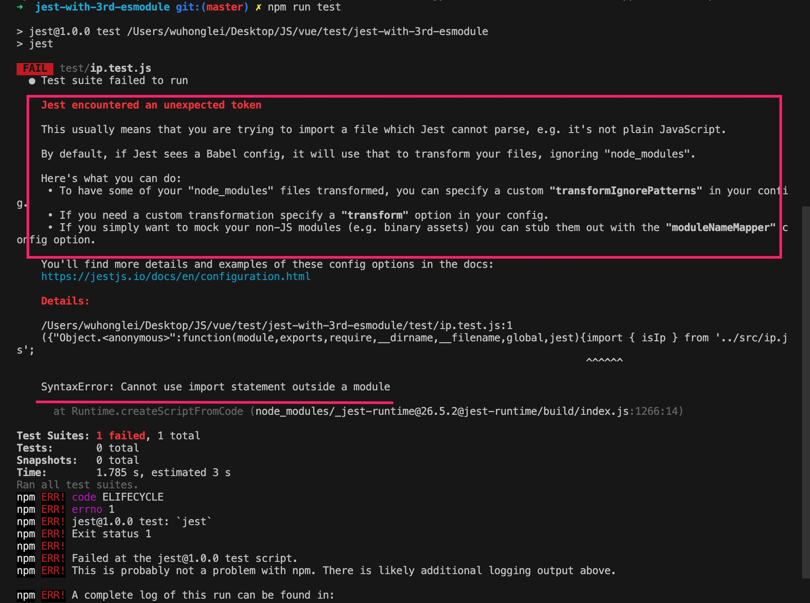
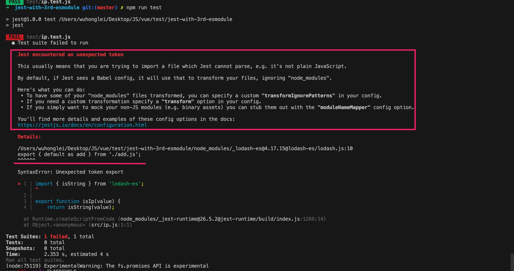
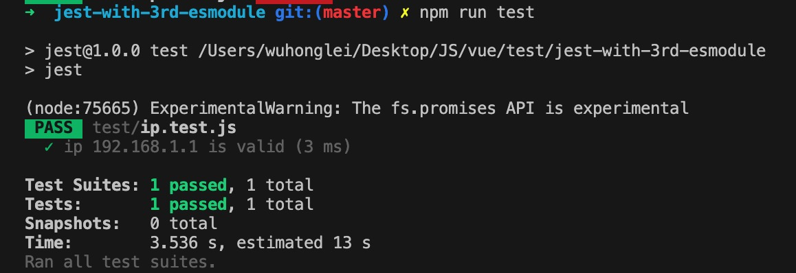
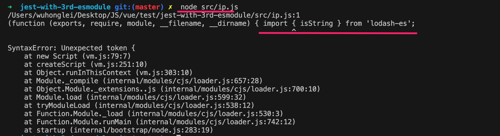

## 说明
该项目用于说明 jest 单测框架如何和 ESM 模块结合使用

### 常见错误
对于一个初始项目，未创建 babel 和 jest 配置时，运行 `npm run test` 的错误如下图所示，错误描述的是 jest 无法解析某些非 js 语法，如果你配置了 babel，transform 默认会忽略 `node_modules` 目录




***

接着我们配置 babel 如下：
```json
// babel.config.json
{
    "presets": [
        [
            "@babel/preset-env"
        ]
    ]
}
```

此时运行时仍会报错，但报错的位置发生变化，如下图所示，错误提示 `lodash-es` 模块内部使用了 es 的 export 语法。根据红色框框的提示，我们知道错误原因是因为 `node_modules/lodash-es` 没有进行 babel 的 transform 转化，因此根据配置连接 [transformIgnorePatterns](https://jestjs.io/docs/en/configuration.html#transformignorepatterns-arraystring) 我们需要进行如下配置




***

jest 配置：
```json
// jest.config.json
{
    "verbose": true,
    "transformIgnorePatterns": [
        "/node_modules/(?!(lodash-es))/",
        "\\.pnp\\.[^\\/]+$"
    ]
}
```

最终成功运行：


附录：

1.jest 运行在 node 环境，因此 js 模块需要以 CommonJS 规范运行，上述的 babel 配置是将 ESM 模块通过 babel 转化为 CommonJS 模块

2.当直接使用 node 运行时 `node src/ip.js`,会报如下错误，同样是因为 node 默认支持 CommonJS 规范。node 12 以上，为了支持 esm 模块，有两种方式：方式 1 是修改文件后缀为 `.mjs`；方式 2 是在 `package.json` 文件中设置 `{"type": "module"}` 字段，同时你得保证你引用的第三方 ESM 模块进行同样的设置。
